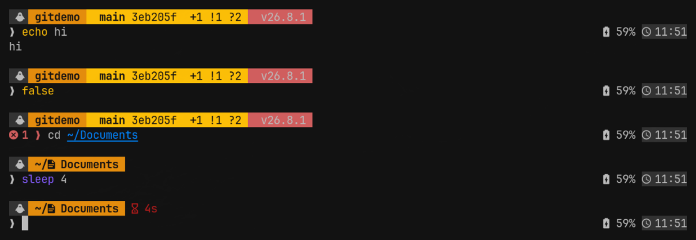

# omarchy-terminal

My terminal setup for [Omarchy](https://omarchy.org): bash with
suggestions, colours and a prompt that actually tells me something.



## What I get from it

**While I type**

- Grey text suggests the rest of the command from my history. `→` accepts it.
- Commands turn green when they exist, red when they do not.
- `Tab` opens a menu with descriptions.

**In the prompt**

- Which folder I am in, with an icon
- Git branch, short commit, and what changed: `✚` staged, `!` modified,
  `?` untracked, `⇡⇣` ahead or behind
- Node, Python, Rust or Go version, but only in a project that uses one
- How long the last command took, if it took over 3 seconds
- Battery and clock on the right
- The `❯` turns red and shows the exit code when a command fails

**Keys**

| Key | What it does |
| --- | --- |
| `→` | Accept the grey suggestion |
| `Tab` | Completion menu |
| `Ctrl-R` | Search my history |
| `Ctrl-T` | Pick a file |
| `Alt-C` | Pick a folder and go there |
| `z name` | Jump to a folder I have been in before |

**Commands**

About 90 aliases and a few functions, in nine groups you can switch on and
off with `aliasgroup`. Type `myalias` to list what is active.

- kubernetes: `k`, `kpf`, `kev`, `klogs`, `events`, `kdebug`, `k9`
- docker: `dps`, `dex`, `dlog`, `dc`, `dcu`, `dcl`, `dprune`
- terraform: `tf`, `tfp`, `tfa`, `tff`
- git: `gpr`, `gprune`
- github: `ghpr`, `ghprs`, `ghrun`
- python: `uvr`, `uva`, `uvenv`
- security scans: `secscan`, `glscan`
- system: `update` (upgrades everything), `myip`, `localip`, `ports`, `mem`, `cpu`

Anything that needs a tool I have not installed simply does not appear.

## What it is made of

| Piece | What it does |
| --- | --- |
| [ble.sh](https://github.com/akinomyoga/ble.sh) | Suggestions, colours, Tab menu |
| [starship](https://starship.rs) | The prompt |
| [ghostty](https://ghostty.org) | The terminal |
| atuin, fzf, zoxide, eza, bat | History, fuzzy find, jumping, listing |

Omarchy already ships everything except ble.sh.

## Install

On a fresh Omarchy machine:

```bash
git clone https://github.com/aganet/omarchy-terminal.git ~/omarchy-terminal
~/omarchy-terminal/install.sh
yay -S --needed blesh-git
```

Open a new terminal. Done.

### Pick what you want

`install.sh` on its own shows a menu. Nothing is forced on you:

```text
Which parts do you want?
> ✓ prompt    The starship prompt: folder, git state, versions, clock
  ✓ typing    ble.sh: suggestions, syntax colours, Tab menu, Enter fix
  ✓ aliases   ~90 aliases in groups you can switch on and off
  ✓ terminal  Ghostty: font, padding, keys (opinionated)
```

`x` toggles a line, Enter confirms. Or name the parts directly:

```bash
./install.sh prompt typing   # just those two
./install.sh --all           # everything, no questions
./install.sh --list          # what the parts are, then stop
```

The bashrc is always installed, because it is the file that loads the
others. Everything already in place is backed up first, with the date in
the name, and running it again is safe.

Not sure? Ask it what it would do:

```bash
$ ./install.sh --all --dry-run

Dry run. Nothing will be changed.
Would install: prompt typing aliases terminal
  would link ~/.bashrc
  would back up ~/.config/starship.toml -> ~/.config/starship.toml.2026-09-26, then link it
  would link ~/.blerc
  ...
Nothing was changed. Run it without --dry-run to do it for real.
```

It tells you exactly which files it would touch and which it would back up
first. `--dry-run` works with any of the forms above.

### The aliases come in groups

My aliases are mine. You probably do not want my kubernetes ones. So they
are split into nine groups, and you switch them on and off by name:

```bash
$ aliasgroup
  on   core         Everyday shortcuts and the group switch
  on   system       System update, network and process helpers
  on   git          git and the GitHub CLI
  on   docker       Docker and compose
  on   kubernetes   kubectl, kubectx, stern, k9s, kind
  on   iac          Terraform, OpenTofu and Helm
  on   cloud        AWS and Azure
  on   python       uv
  on   security     Secret, dependency, container and IaC scanners

$ aliasgroup off kubernetes
kubernetes off. Open a new terminal.
```

Turning one off writes its name to `~/.config/bash/aliases.disabled`. The
repo files are never touched, so `git pull` keeps working and `git status`
stays clean. `aliasgroup on kubernetes` brings it back.

Do not want any of them? `./install.sh --no-aliases` and you still get the
prompt and the typing setup.

Want your own instead? Drop a file in `~/.bash_aliases.d/`. Anything in
there is loaded, and `90-mine` sorts after my groups so it wins.

Run `myalias` to see what is actually defined, or `myalias docker` to
filter. Every alias is wrapped in `command -v` anyway, so one for a tool
you have not installed does not exist in the first place.

### My tools (optional)

The aliases cover tools I do not always need. Install the ones you want:

```bash
# in the Arch repos
sudo pacman -S --needed git-delta kubectl kubectx helm k9s stern kind \
  opentofu terraform aws-cli azure-cli gitleaks trivy syft cosign sops age \
  dive tflint osv-scanner popeye crane

# from the AUR
yay -S --needed trufflehog grype kube-score kubescape hadolint conftest

# python tools
uv tool install checkov
uv tool install semgrep
```

Then make git use delta for diffs:

```bash
git config --global core.pager "delta"
git config --global interactive.diffFilter "delta --color-only"
git config --global delta.navigate true
git config --global delta.line-numbers true
git config --global delta.side-by-side true
git config --global merge.conflictstyle "zdiff3"
```

### Private things

For work hostnames or anything I do not want on GitHub:

```bash
cp ~/omarchy-terminal/home/bashrc.local.example ~/.bashrc.local
```

That file is not in git. `~/.bashrc` reads it last, so it can override
anything.

## What is in the repo

| File | Goes to |
| --- | --- |
| `home/bashrc` | `~/.bashrc` |
| `home/blerc` | `~/.blerc` |
| `home/aliases.d/` | `~/.bash_aliases.d/` |
| `home/bashrc.local.example` | `~/.bashrc.local`, by hand |
| `config/starship.toml` | `~/.config/starship.toml` |
| `config/ghostty/config` | `~/.config/ghostty/config` |

## Tweaks

- Suggestions too dark or too bright: change `fg=245` in `home/blerc`.
  232 is dark, 255 is light.
- No clock: delete the `right_format` line in `config/starship.toml`.
- No battery: set `disabled = true` under `[battery]`.
- One line instead of two: take `$character` off its own line in `format`.

## Making changes

The files in my home folder are links into this repo, so editing
`~/.bashrc` edits the repo:

```bash
cd ~/omarchy-terminal
git add -A && git commit -m "what changed" && git push
```

On another machine: `git pull`, then open a new terminal.

## Worth knowing

Prompt colours are palette names, not fixed colours. The prompt follows
whatever Omarchy theme is active.

`shell-integration = none` in the ghostty config is deliberate. `.bashrc`
loads ghostty's integration itself. Without it ble.sh attaches too late and
the first prompt is drawn twice.

Enter is rebound in `home/blerc` so a pasted multi-line command runs. That
rebind sits in ble.sh's `keymap_emacs` after-load hook, because ble.sh
installs its own keymap after `.blerc` is read. `Alt-Enter` adds a line by
hand.

## Also mine

- [omarchy-sysmon](https://github.com/aganet/omarchy-sysmon) — a small
  CPU, memory and network widget for the Omarchy bar
- [zsh](https://github.com/aganet/zsh) — the same idea in zsh, for my other
  machines. Most of the aliases here came from there.
